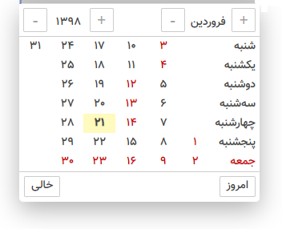

<div dir="rtl">

## مشاهده دمو - [DEMO](http://projects.radoo.ir/Mh1PersianDatePicker/)


> Mh1PersianDatePicker

## استفاده
 1- دوفایل زیر را به پروژه اضافه کنید
 <br>
 Mh1PersianDatePicker.js & Mh1PersianDatePicker.css

```html
<link type="text/css" rel="stylesheet" href="Mh1PersianDatePicker.css" />
<script type="text/javascript" src="Mh1PersianDatePicker.js"></script>
```

2- حال برای فعال سازی فقط کافی است متد زیر را فراخوانی کنید

```html
<script>
	Mh1PersianDatePicker.Show(this, '1397/12/21',['1397/12/29','1397/12/28']); //parameter1: input, parameter2: today, parameter3: holidays
</script>
```
</div>